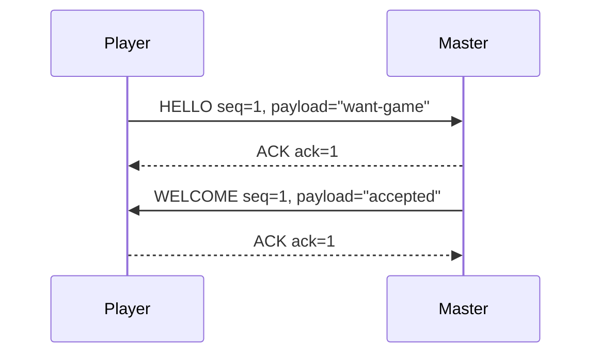
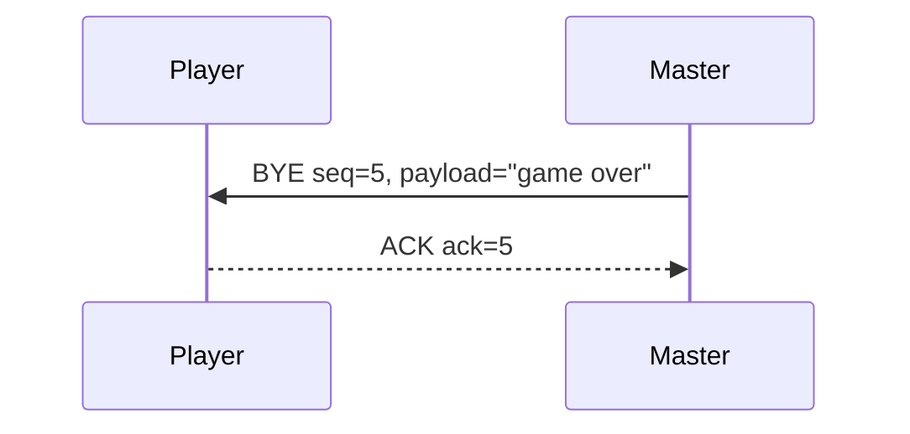
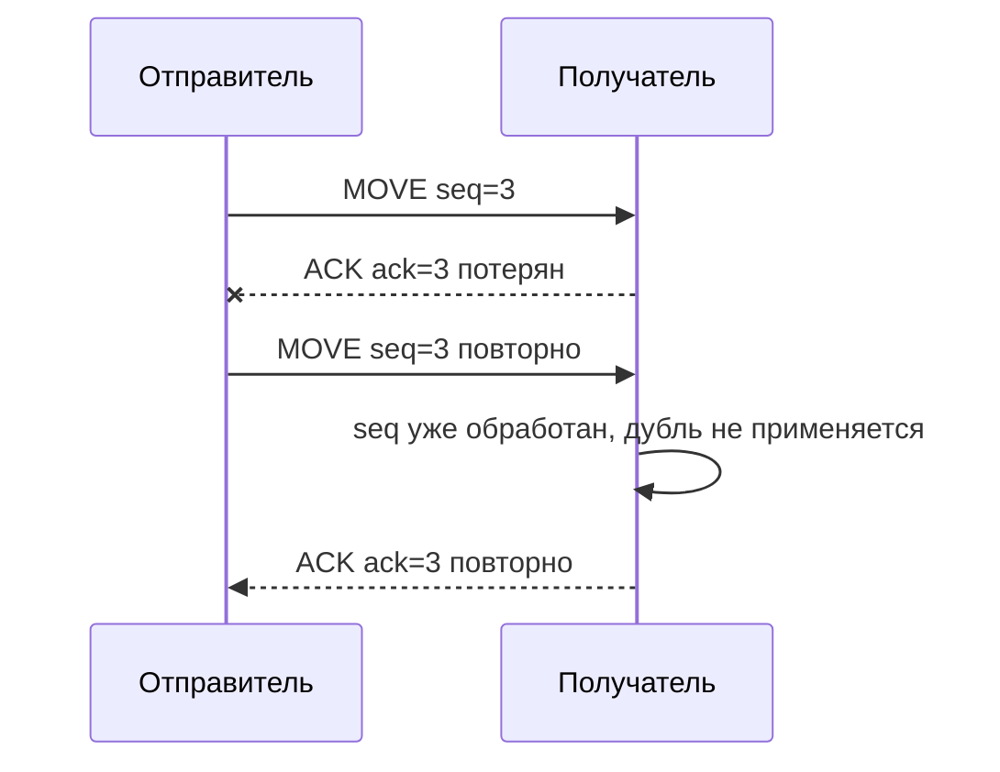

# UDP Peer Game

## Описание проекта

Игра «Камень-ножницы-бумага», написанная с использованием одноранговой архитектуры.  
Приложение реализовано на языке C++ с использованием программного интерфейса сокетов Беркли.  
В качестве транспортного протокола используется UDP. Поверх UDP разработан собственный протокол прикладного уровня с подтверждением сообщений и контролем порядка обработки.

Один и тот же исполняемый файл может быть запущен в двух режимах без перекомпиляции:

- `master` — режим мастера, ожидающего входящий запрос на игру;
- `player` — режим игрока, инициирующего запрос на игру.

Приложение поддерживает одновременную игру только с одним игроком. После подключения первого игрока master запоминает его IP-адрес и UDP-порт, а сообщения от других отправителей игнорируются.

Игра проводится в 3 раунда. В каждом раунде player отправляет свой ход, master вводит свой ход локально, после чего master вычисляет результат раунда и отправляет его player. После завершения трёх раундов master отправляет сообщение о завершении игры.

## Архитектура приложения

Приложение состоит из следующих логических частей:

1. **Сетевой уровень**
   - создание UDP-сокета;
   - привязка сокета к локальному порту через `bind`;
   - отправка пакетов через `sendto`;
   - приём пакетов через `recvfrom`;
   - ожидание входящих данных с таймаутом через `select`.

2. **Прикладной протокол**
   - формирование пакетов с заголовком;
   - сериализация и десериализация сообщений;
   - подтверждение сообщений через `ACK`;
   - повторная отправка при потере подтверждения;
   - проверка порядка сообщений через поле `seq`.

3. **Игровая логика**
   - обработка подключения;
   - приём хода игрока;
   - ввод хода мастера;
   - вычисление результата раунда;
   - завершение игры.

## Особенности режима master

Режим master запускается командой:

```bash
./game --master 5000
```

В этом режиме программа:

1. создаёт UDP-сокет;
2. связывает его с портом `5000`;
3. ожидает сообщение `HELLO` от player;
4. отправляет `WELCOME`;
5. принимает ходы игрока;
6. отправляет результаты раундов;
7. завершает игру сообщением `BYE`.

## Особенности режима player

Режим player запускается командой:

```bash
./game --player <IP_MASTER> 5000
```

Например:

```bash
./game --player 192.168.1.34 5000
```

В этом режиме программа:

1. создаёт UDP-сокет;
2. формирует адрес master по IP и порту;
3. отправляет `HELLO`;
4. ожидает `WELCOME`;
5. отправляет свои ходы;
6. получает результаты раундов;
7. принимает сообщение `BYE` о завершении игры.

## Сборка

```bash
make
```

После успешной сборки появляется исполняемый файл:

```bash
game
```

## Локальный запуск

Терминал 1:

```bash
./game --master 5000
```

Терминал 2:

```bash
./game --player 127.0.0.1 5000
```

## Запуск через локальную сеть

На компьютере, где запускается master:

```bash
ip addr
./game --master 5000
```

На втором компьютере:

```bash
ping <IP_MASTER>
./game --player <IP_MASTER> 5000
```

Например:

```bash
ping 192.168.1.34
./game --player 192.168.1.34 5000
```

## Протокол взаимодействия клиента с сервером

Протокол бинарный, построен поверх UDP. По умолчанию для демонстрации используется порт `5000`.  
Так как UDP не гарантирует доставку, порядок и отсутствие дублирования, в прикладном протоколе предусмотрены:

- номера сообщений `seq`;
- подтверждения `ACK`;
- повторная отправка при таймауте;
- отбрасывание дубликатов;
- игнорирование сообщений, пришедших не по порядку.

### Формат пакета

| Поле | Размер | Назначение |
|---|---:|---|
| `magic` | 2 байта | сигнатура протокола `0x4750` |
| `version` | 1 байт | версия протокола |
| `type` | 1 байт | тип сообщения |
| `seq` | 4 байта | номер сообщения |
| `ack` | 4 байта | номер подтверждаемого сообщения |
| `length` | 2 байта | длина полезной нагрузки |
| `payload` | `length` байт | данные сообщения |

Многобайтовые числовые поля передаются в сетевом порядке байтов.

### Типы сообщений

| Код | Тип | Назначение |
|---:|---|---|
| 1 | `HELLO` | запрос player на начало игры |
| 2 | `WELCOME` | подтверждение подключения от master |
| 3 | `MOVE` | ход игрока |
| 4 | `RESULT` | результат раунда |
| 5 | `ACK` | подтверждение получения сообщения |
| 6 | `ERROR` | ошибка протокола |
| 7 | `BYE` | завершение игры |

## Диаграммы последовательностей

### Подключение к master



### Ход игрока и получение результата

```mermaid
sequenceDiagram
    participant P as Player
    participant M as Master

    P->>M: MOVE seq=N, payload="rock/paper/scissors"
    M-->>P: ACK ack=N
    M->>M: Ввод хода master
    M->>M: Расчёт результата раунда
    M->>P: RESULT seq=K, payload="round=...;winner=...;score=..."
    P-->>M: ACK ack=K
```

### Завершение игры



### Повторная отправка при потере ACK



## Механизм подтверждения и порядка

Для надёжной передачи используется схема `stop-and-wait`.

Алгоритм отправителя:

1. отправить сообщение с номером `seq`;
2. ожидать `ACK`, где `ack == seq`;
3. если `ACK` получен, перейти к следующему сообщению;
4. если `ACK` не получен за таймаут, отправить сообщение повторно;
5. после превышения числа попыток завершить обмен с ошибкой.

Алгоритм получателя:

1. принять UDP-пакет;
2. проверить сигнатуру, версию и размер;
3. сравнить `seq` с ожидаемым номером;
4. если номер совпадает — обработать сообщение и отправить `ACK`;
5. если номер меньше ожидаемого — считать пакет дублем и повторно отправить `ACK`;
6. если номер больше ожидаемого — игнорировать пакет как пришедший вне очереди.

## Пример логов работы

Master:

```text
Master mode. Waiting HELLO on UDP port 5000...
[recv] HELLO seq=1 ack=0 from=127.0.0.1:54008 payload="want-game"
[send] ACK seq=0 ack=1 to=127.0.0.1:54008
[send] WELCOME seq=1 ack=0 to=127.0.0.1:54008 payload="accepted"
[recv] ACK seq=0 ack=1 from=127.0.0.1:54008
[ok] ACK received for seq=1
```

Player:

```text
[send] HELLO seq=1 ack=0 to=127.0.0.1:5000 payload="want-game"
[recv] ACK seq=0 ack=1 from=127.0.0.1:5000
[recv] WELCOME seq=1 ack=0 from=127.0.0.1:5000 payload="accepted"
[send] ACK seq=0 ack=1 to=127.0.0.1:5000
Connected: accepted
```

## Внутренняя документация

Для генерации внутренней документации рекомендуется использовать Doxygen.

Установка:

```bash
sudo apt update
sudo apt install doxygen graphviz
```

Генерация конфигурационного файла:

```bash
doxygen -g Doxyfile
```

Генерация документации:

```bash
doxygen Doxyfile
```

После генерации HTML-документация будет находиться в каталоге:

```bash
html/index.html
```

Внутренняя документация должна включать комментарии к:

- перечислению `MsgType`;
- структуре `Packet`;
- классу `UdpPeer`;
- функциям сериализации и разбора пакетов;
- функциям `sendReliable` и `recvReliable`;
- функциям запуска режимов `runMaster` и `runPlayer`.
